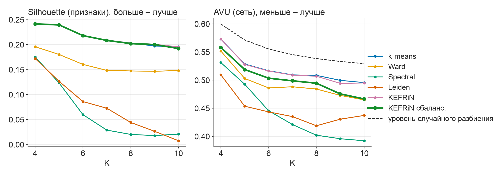
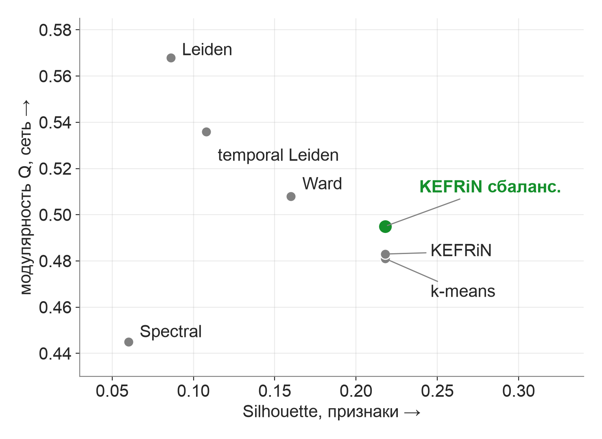
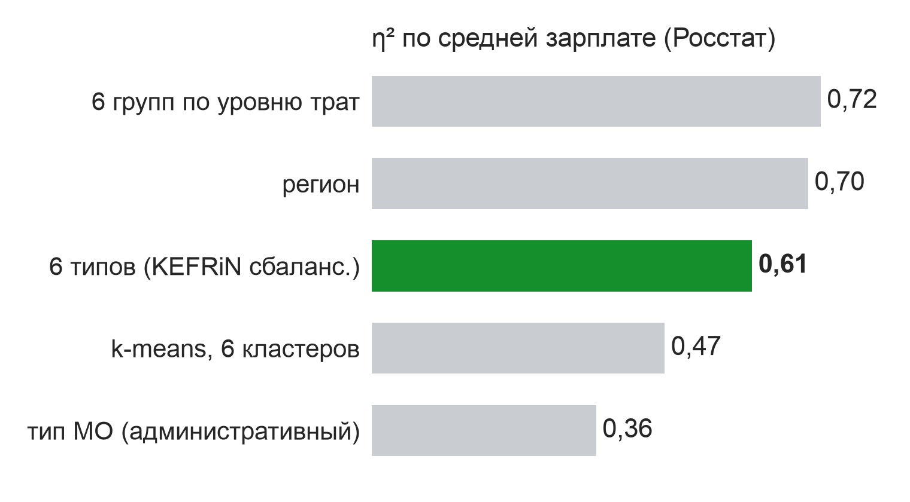
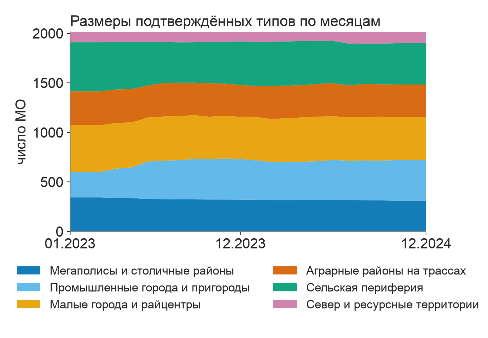
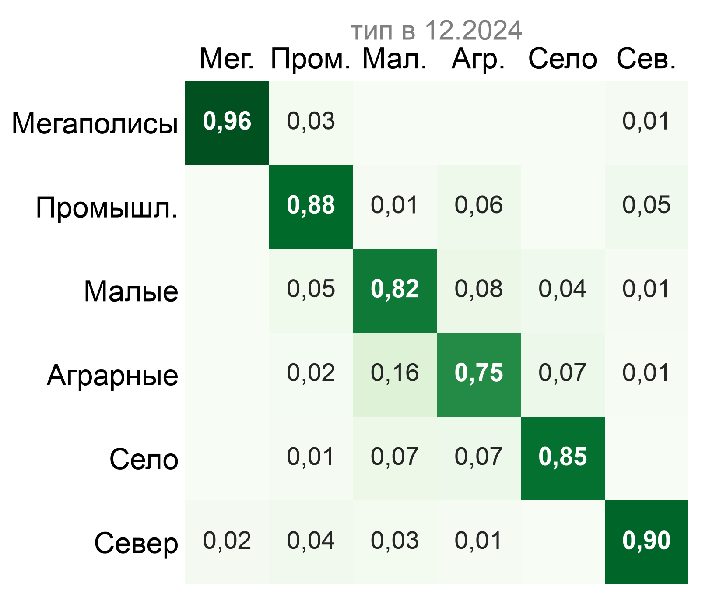

# Типы локальных экономик России по безналичным тратам

Динамическая атрибутированная сеть муниципальных образований

<strong>Pulsar.</strong> Екатерина Алексанян, МГУ&nbsp;имени&nbsp;М.&nbsp;В.&nbsp;Ломоносова,&nbsp;ВМК

Лендинг: estnafinema0.github.io/sberindex-pulsar

Репозиторий: github.com/estnafinema0/sberindex-pulsar

Данные: Лаборатория СберИндекс, CC BY-SA 4.0

Лендинг

Код

---

## Вопрос и польза

Вопрос

Можно ли по ежемесячным безналичным тратам выделить устойчивые типы локальных экономик 2 016 МО и замечать их сдвиги раньше годовой статистики?

Кому полезно

Региональным органам власти – для мониторинга МО между выходами статистики; аналитикам – для подбора сопоставимых МО.

---

## В тратах 2 016 МО видны шесть типов

<b>6 типов</b> доля МО

<ul class="tlist">
<li>Мегаполисы и столичные районы<b>16 %</b></li>
<li>Промышленные города и пригороды<b>20 %</b></li>
<li>Малые города и райцентры<b>22 %</b></li>
<li>Аграрные районы на трассах<b>16 %</b></li>
<li>Сельская периферия<b>21 %</b></li>
<li>Север и ресурсные территории<b>6 %</b></li>
</ul>

61 %

Типы объясняют 61 % разброса зарплат по Росстату, которые в модель не входили

68 %

МО ни разу не сменили подтверждённый тип за 2023–2024&nbsp;гг.

---

## Семь признаков описывают состав и уровень трат

Шесть компонент трат, медианная доля в итоге

44,7 %

Продовольствие

13,5 %

Маркетплейсы

5,7 %

Транспорт

4,9 %

Здоровье

2,6 %

Общественное питание

≈ 28 %

Прочее

÷ медиана

седьмой признак – уровень трат к медиане страны в том же месяце

2 016 МО, 24 месяца. Данные Росстата в признаки не входят, они оставлены для проверки.

CLR – логарифм доли относительно среднего геометрического; стандарт для долей. Все признаки сглаживаются средним за три месяца и стандартизуются внутри месяца.

---

## Три слоя сети почти не пересекаются

<b>SNF</b> – слияние нескольких графов в один. <b>KEFRiN</b> – кластеризация сразу по признакам и сети. <b>ARI</b> – совпадение двух разбиений (1 – полностью совпадают).

Поведение

сходство профилей трат

взаимные 10 ближайших соседей, ядро exp(−d²/σᵢσⱼ)

<b>6,3</b> ср. степень

Со-движение трат

синхронные приросты трат

лаговая корреляция за 12 мес., 10 самых сильных связей

<b>5,8</b> ср. степень

Дороги

расстояние по автодорогам

exp(−D / 200 км), 10 ближайших соседей

<b>12,5</b> ср. степень

→

Слияние SNF

<b>8,5</b> ср. степень, граф связный

Leiden на каждом слое даёт свою типологию, KEFRiN – почти одну и ту же

ARI между слоями: 0,87–0,93 (насколько типология KEFRiN совпадает на разных слоях). Доля общих рёбер (Жаккар) 0,015–0,035.

---

## Семь методов на одних признаках и графе, K = 6

| метод | данные | SW ↑ | CH ↑ | S_Dbw ↓ | AVI ↑ | AVU ↓ | MQ ↑ |
|---|---|---|---|---|---|---|---|
| k-means | признаки | **0,218** | **646** | 0,87 | 0,665 | 0,517 | 0,481 |
| Ward | признаки | 0,160 | 518 | 0,84 | 0,704 | 0,486 | 0,508 |
| Spectral | сеть | 0,060 | 214 | 0,81 | 0,839 | 0,446 | 0,445 |
| Leiden | сеть | 0,086 | 293 | **0,73** | **0,849** | 0,444 | **0,568** |
| temporal Leiden | сеть, 24 месяца сразу | 0,108 | 290 | **0,73** | 0,830 | **0,406** | 0,536 |
| KEFRiN | признаки и сеть | **0,218** | **646** | 0,84 | 0,665 | 0,516 | 0,483 |
| KEFRiN сбалансированный | признаки и сеть, равные вклады | **0,218** | 645 | 0,88 | 0,684 | 0,504 | 0,495 |

Медиана по 24 месяцам (табл. 1 отчёта), лучшее по столбцу выделено. SW, CH, S_Dbw – по признакам; AVI, AVU, MQ – по сети. Граф месяца t строится только по данным до месяца t включительно.

---

## ICVI: признаковые методы лучше по SW, CH, S_Dbw, сетевые – по AVI, AVU, MQ

AVU – средняя «объединяемость» кластеров по рёбрам, меньше – лучше; пунктир – уровень случайного разбиения. Реализации индексов сверены с библиотекой Pattern Лаборатории СберИндекс.

---

## Выбран сбалансированный KEFRiN, K = 6

Среди методов с SW ≥ 0,2 – лучший по сети: MQ 0,495 против 0,481 у k-means, AVI 0,684 против 0,665 (значимо по парному бутстрэпу). Leiden сильнее по сети (MQ 0,568), но SW 0,086 – типы не читаются по тратам.

Устойчивость к бутстрэпу МО: ARI 0,78 (Leiden 0,52).

При K = 6 максимальна z-оценка AVU, худший кластер устойчив (Жаккар 0,78).

---

## Типы различаются уровнем и составом трат

| тип | доля МО | траты к медиане | отличие |
|---|---|---|---|
| Мегаполисы и столичные районы | 16 % | 186 % | больше всего общепита и транспорта |
| Промышленные города и пригороды | 20 % | 121 % | обрабатывающая промышленность (Росстат) |
| Малые города и райцентры | 22 % | 92 % | переходный тип между селом и городом |
| Аграрные районы на трассах | 16 % | 89 % | высокая доля транспорта, чаще других меняет тип |
| Сельская периферия | 21 % | 82 % | почти половина трат на продовольствие |
| Север и ресурсные территории | 6 % | 154 % | маркетплейсов вдвое меньше |

---

## Типы объясняют 61 % разброса зарплат

η² – доля разброса показателя, объяснённая группой. Зарплаты и население Росстата в модель не входили.

<b>0,48</b> η² по населению

Без внутригородских территорий Москвы и Петербурга η² по зарплате 0,48 (уровень трат –&nbsp;0,62).

Шкала уровня трат объясняет зарплату чуть лучше (0,72), но не различает Север (154 % медианы) и мегаполисы (186 %) по структуре трат; типы учитывают и уровень, и профиль.

---

## За два года 68 % МО сохранили тип

Смена подтверждается, если новый тип держится ≥ 3 мес. и бутстрэп-уверенность ≥ 0,7: 963 из 4 112 сырых смен. Мобильность (индекс Шоррокса) 0,02 за месяц, 0,17 за год (декабрь 2023 → декабрь 2024) (0 – никто не меняет тип).

---

## Шок снижает уверенность в типе, но не меняет его

Орск, паводок 2024

0,50–0,57

бутстрэп-уверенность типа Орска: доля голосов за его тип в 30 перезапусках (обычно 0,83–1,00)

Апрель 2023, смена методики

62 из 567

сырых смен апреля подтвердились, остальные 505 – артефакт смены методики

Объединения МО 2024 г.

10 из 10

месяцев Павлово-Посадский округ наследует тип предшественников

Все смены типа за два года

963 из 4 112

сырых смен подтвердились (23 %)

---

## Ограничения и следующие шаги

Ограничения

Только безналичные траты клиентов Сбера, нет восьми регионов.

Подтверждение смены типа запаздывает на два месяца.

K = 6 выбран по компромиссу индексов.

Пороги 3 мес. и 0,7 заданы экспертно.

Клиенты Сбера – не вся экономика: смещение к городам.

Дальше

Трикластеризация куба МО × категория × месяц.

Скрытая марковская модель переходов вместо правила подтверждения.

---
## Выводы

**6 устойчивых типов** локальных экономик; 68 % МО не сменили тип за два года.

Типы объясняют 61 % разброса зарплат Росстата, хотя эти данные в модель не входили.

Смену методики отфильтровывает правило подтверждения (62 из 567), шоки видны как падение уверенности.

estnafinema0.github.io/sberindex-pulsar github.com/estnafinema0/sberindex-pulsar

Лендинг

Код

